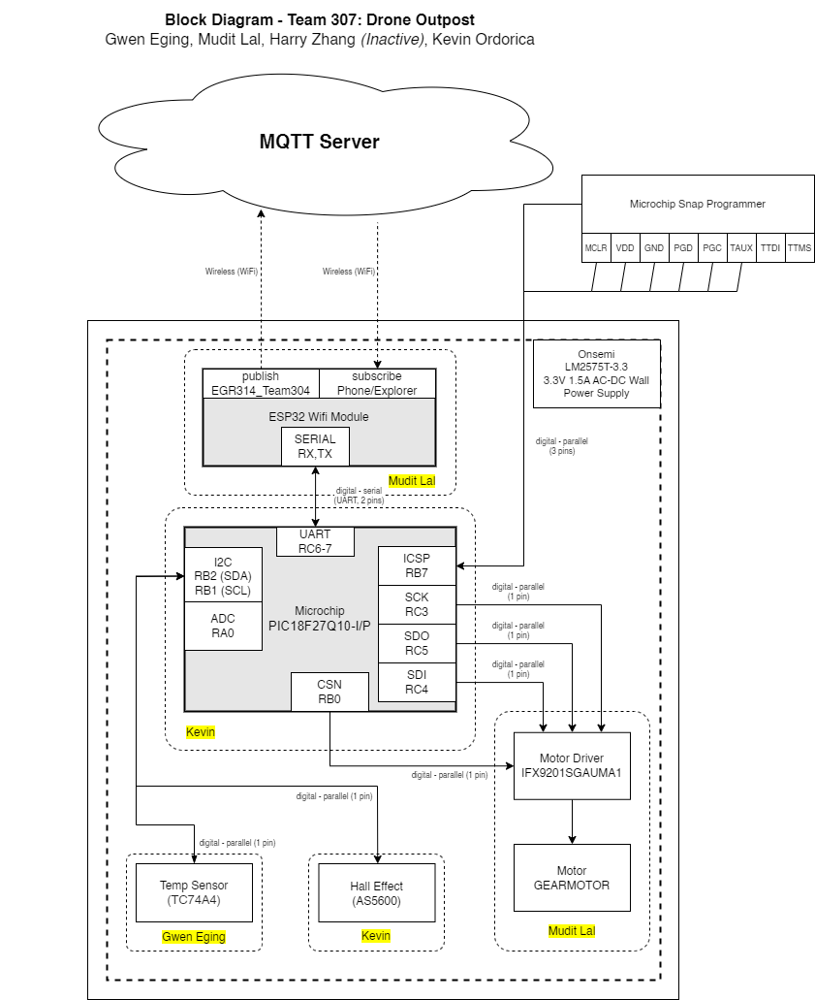

# 📊 **Block Diagram**

---

## 📖 **Overview**  
This is the diagram showing how each subsystem will communicate and work together to make a cohesive product. 

---

---

## 🔄 **Back to Main Page**  
[⬅️ Return to Home](./index.md)