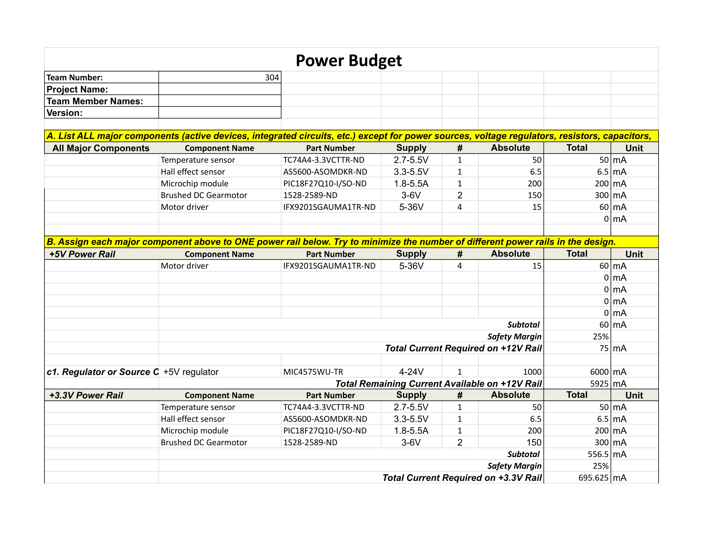
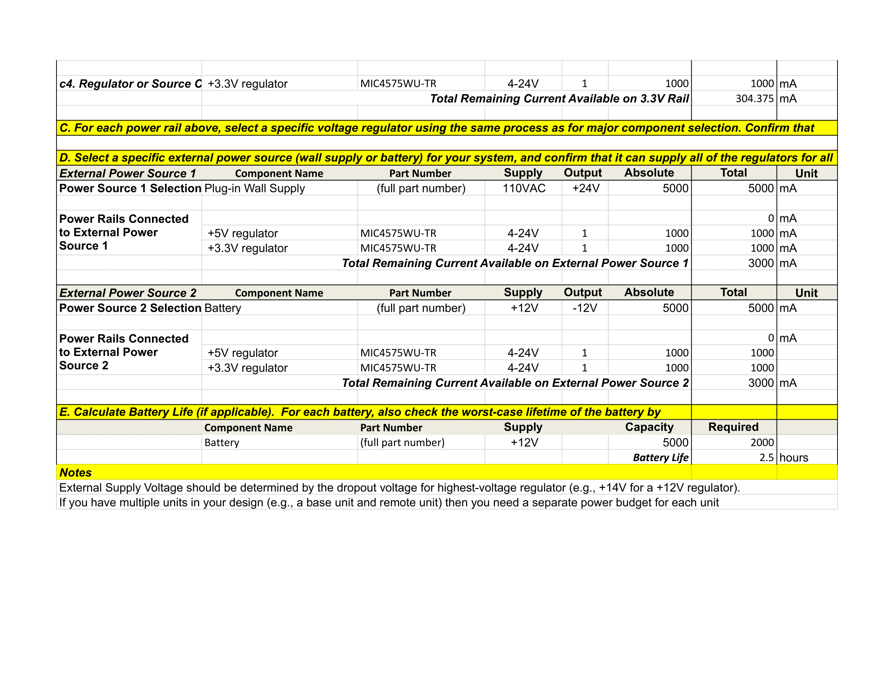

<<<<<<< HEAD
# **Component Selection**

---

## **Overview**  
=======
#  **Component Selection**

---

##  **Overview**  
>>>>>>> 09b1c9029494bcdaf3b739f88ee7d3e87805d6f8
The team looked through multiple components that would satisfy the project's design requirements. There are numerous component options per subsystem and the pros and cons of each were evaluated. 

The power budget for the project is below, it helps determine the total power and current needed to operate the product. 

---

<<<<<<< HEAD
## **Related Diagrams**  
=======
##  **Related Diagrams and Charts**  
>>>>>>> 09b1c9029494bcdaf3b739f88ee7d3e87805d6f8

---

---

---

##  **References & Links**  
- [Link to Component Selection](https://docs.google.com/document/d/1kWYuAGZ4DDEa-Eb_hZqsf3toUmlS0YjSmsRxY7EymRY/edit?tab=t.0#heading=h.d3d2zocmnw0i)
- [Link to Power Budget](https://docs.google.com/spreadsheets/d/1ak7A8Na6I4434-JXlQxHVtz957ucP1a1/edit?gid=1452261071#gid=1452261071)

---

##  **Back to Main Page**  
[ Return to Home](./index.md)
