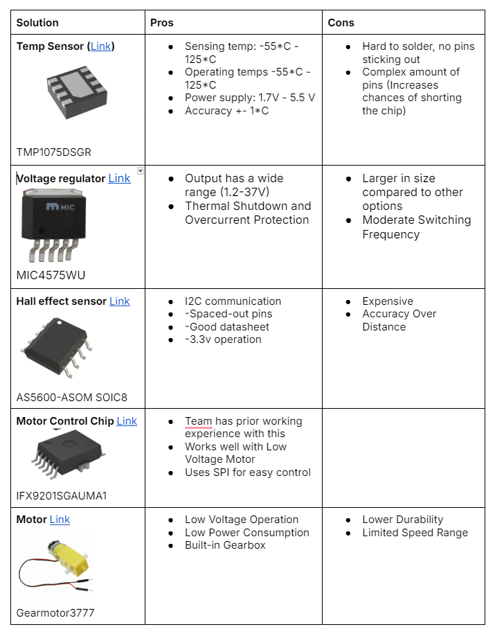

# **Component Selection**

---

## **Overview**  
The team looked through multiple components that would satisfy the project's design requirements. There are numerous component options per subsystem and the pros and cons of each were evaluated. 

The power budget for the project is below, it helps determine the total power and current needed to operate the product. 

---

## **Related Diagrams**  

---

---

---

## 🔗 **References & Links**  
- [Link to Component Selection](https://docs.google.com/document/d/1kWYuAGZ4DDEa-Eb_hZqsf3toUmlS0YjSmsRxY7EymRY/edit?tab=t.0#heading=h.d3d2zocmnw0i)
- [Link to Power Budget](https://docs.google.com/spreadsheets/d/1ak7A8Na6I4434-JXlQxHVtz957ucP1a1/edit?gid=1452261071#gid=1452261071)

---

## 🔄 **Back to Main Page**  
[⬅️ Return to Home](./index.md)