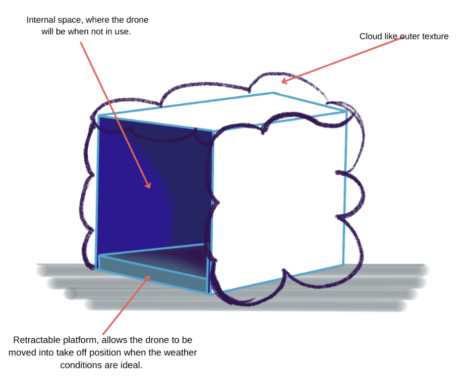
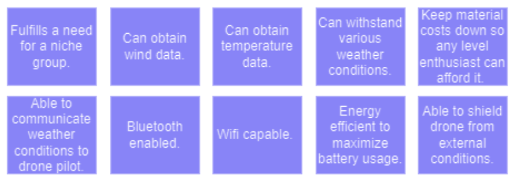

<<<<<<< HEAD
# **Design Ideation**
---
The initial design ideation was when our team was going in a different direction. Once we understood the project better we decided to redesign the idea. 
## **Selected Design**  
=======
#  **Design Ideation**
---
The initial design ideation was when our team was going in a different direction. Once we understood the project better we decided to redesign the idea. 
##  **Selected Design**  
>>>>>>> 09b1c9029494bcdaf3b739f88ee7d3e87805d6f8
The team came up with a concept different from the ones from the previous ideation. After choosing the sensors and components needed to fulfill project requirements the team realized the initial concept was not going to work. Initially, we wanted to make a device that was whimsical, and able to be taken hiking to give real-time data and predictions. 

---

Instead of going with an initial device idea, we decided to go with a device that can house a drone, gather weather data for flying conditions, and communicate that to the user. Some parts of the ideation process were taken into consideration when designing the device. It still needs to be weatherproof, and able to predict and communicate the data to a user, and we did try to keep the whimsical appearance. 

---

<<<<<<< HEAD
## **Back to Main Page**  
[⬅️ Return to Home](./index.md)
=======
##  **Back to Main Page**  
[ Return to Home](./index.md)
>>>>>>> 09b1c9029494bcdaf3b739f88ee7d3e87805d6f8
