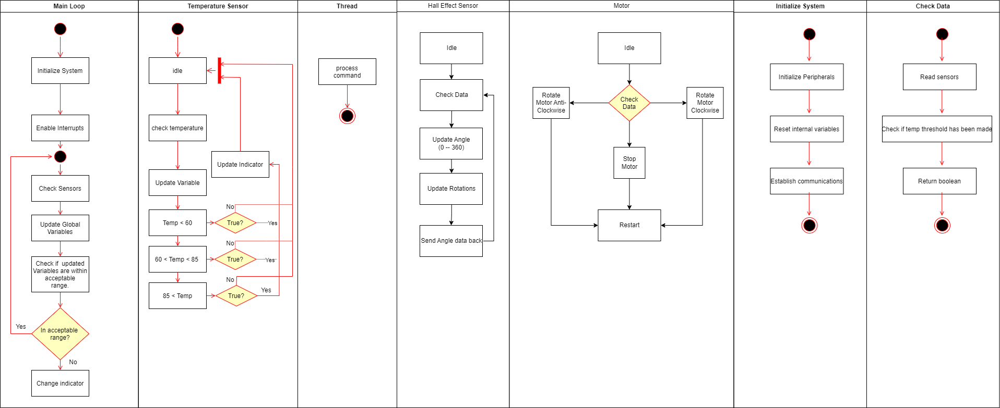

# 📝 **Software Proposal**

---

## 📖 **Overview**  
The software is geared to utilize the temperature sensor and hall effect sensor to simplify the decision process in regards to when to fly a drone. The Microprocessor will read data from the two sensors to help get accurate and live data. Once the data is acquired it will check to see if the conditions fall into pre-assigned thresholds. If the weather is ideal for drone take off it will ping the user to communicate the information, and a platform will slide out of the station. This will allow the user to operate the drone and take off. If the weather changes to the middle threshold an alert will be sent to the user warning them of the impending risks and change in weather. This is a warning to start heading back to the station for landing. The third and final threshold is an extreme warning, meaning it is time to get the drone back and safely put away as it is at risk from the weather. 

---

## 📊 **Related Diagrams and Charts**  
If there are relevant diagrams or charts, add a placeholder or instructions for embedding images below:

---

---

---

## 🔗 **References & Links**  
- [Link](https://app.diagrams.net/#G1xlFvtV_mzvnqlJUobaKzlR6I_mj8l-aW#%7B%22pageId%22%3A%22e7e014a7-5840-1c2e-5031-d8a46d1fe8dd%22%7D)  
- Cite external sources or internal project pages as needed.  

---

## 🔄 **Back to Main Page**  
[⬅️ Return to Home](./index.md)
```
