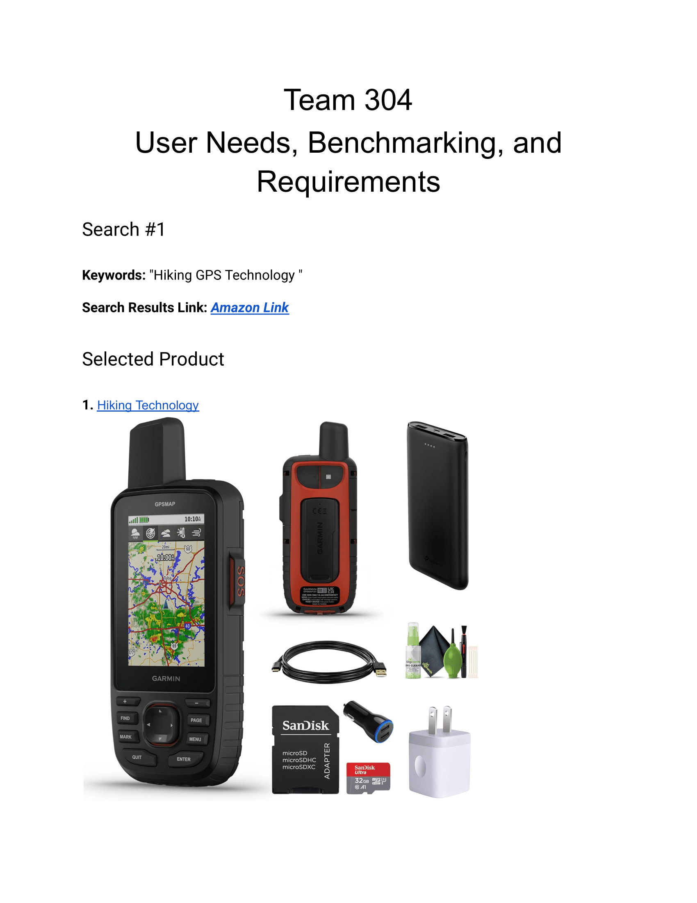
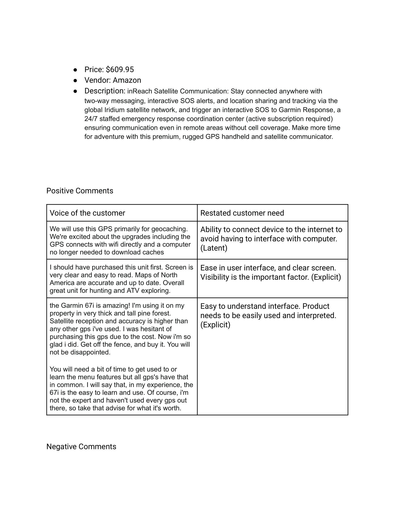
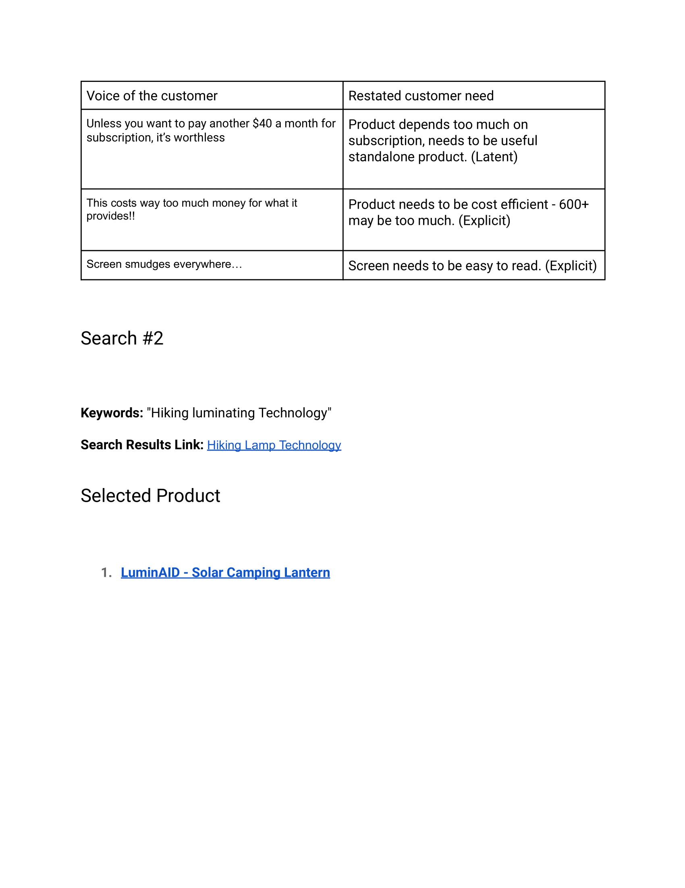
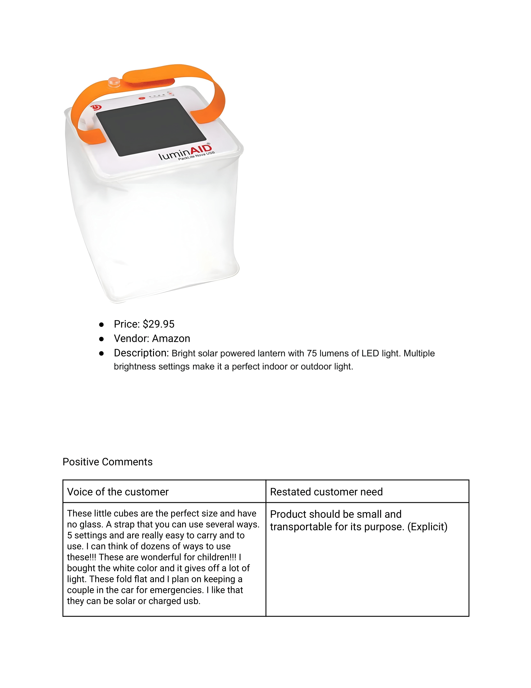
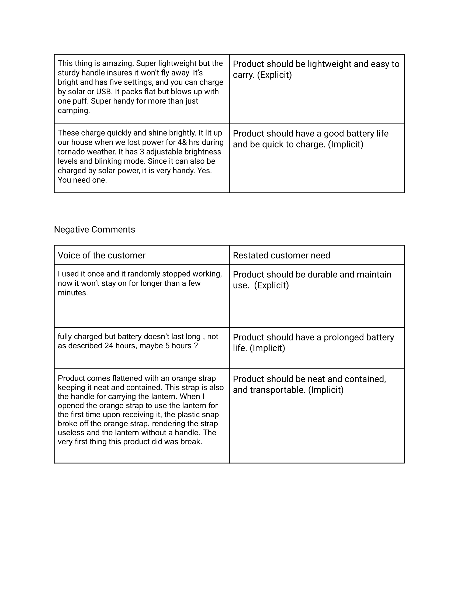
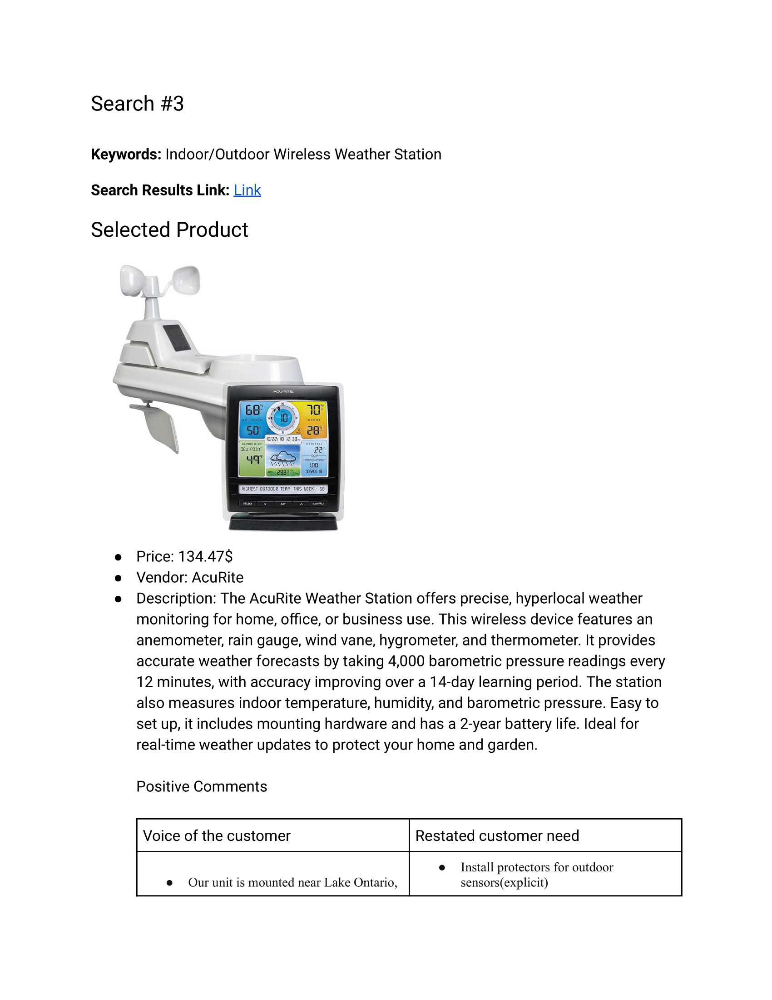
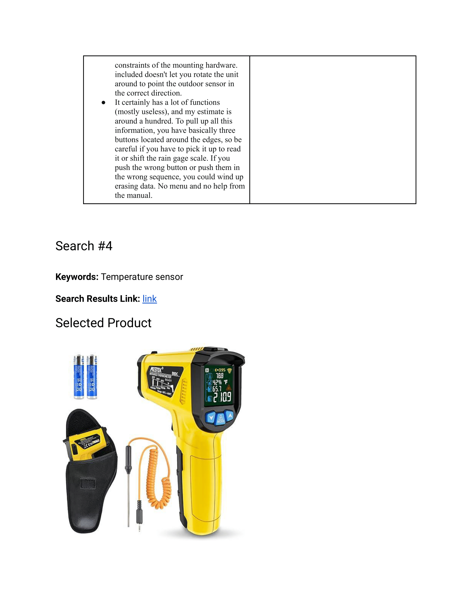
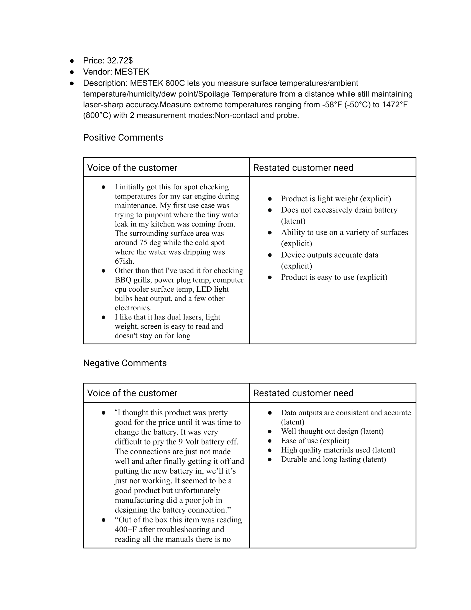
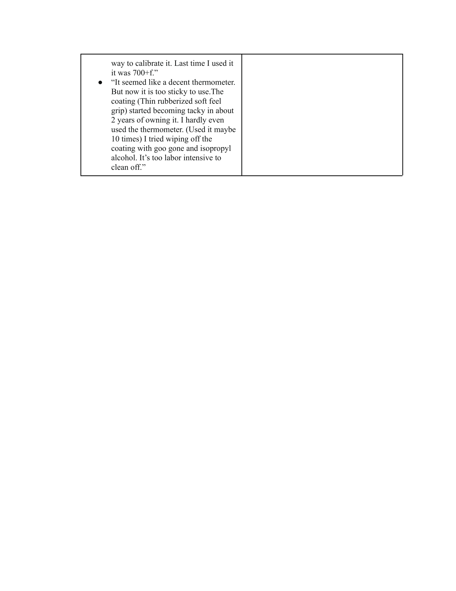

# **User Needs, Benchmarking and Requirements**

---

## **Problem Statement**  
The problem we chose to address is that the environment can change unpredictably while operating a drone and hobbyist drones are less equipt to handle extreme weather. This causes the drone to be subjected to hazardous conditions or to get lost. By developing a station to house the drone and communicate data in real-time to the user we hope to minimize the risks involved in operating hobbyist drones. 

---

## **Baseline Requirments**  
From surveying base requirements: 
- Notify the user of temperature outside of 32 degrees to 104 degrees.
- Notify the user that 10-15 mph wind speeds are potentially hazardous and that over 20 mph means no fly.
- Able to house various hobbyist drone sizes.

---

## **Past Assignment**    
---

---

## **Back to Main Page**  
[⬅️ Return to Home](./index.md)